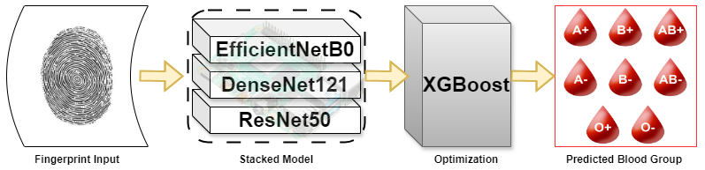
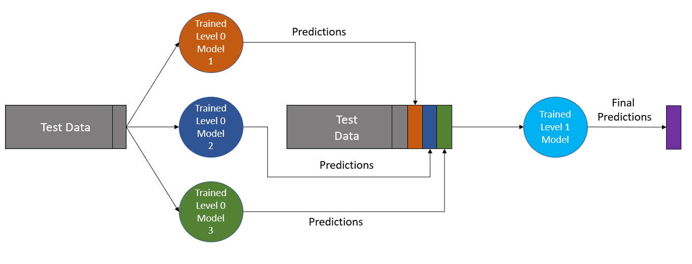

# Ensemble Learning Framework for Blood Group Identification Using Fingerprint Patterns

This project presents an **Ensemble Learning Framework** for blood group identification using fingerprint images. The current implementation is a **Django-based web application** that allows users to upload a fingerprint and receive the predicted blood group as output.

### Core Idea

This system utilizes a **stacked ensemble of deep learning models** for feature extraction and a powerful **XGBoost classifier** for final prediction. The goal is to establish a non-invasive, rapid, and scalable method for blood group identification, which can be further extended to hardware integration.

---

### Architecture

#### 1. Ensemble Pipeline Overview


#### 2. Stacked Model Details


- **Fingerprint Input**: Image is preprocessed.
- **CNN Models**: ResNet50, EfficientNetB0, and DenseNet121 extract features.
- **XGBoost Classifier**: Takes stacked features and outputs probabilities for each blood group.

---

### Features

- Upload fingerprint image through a simple UI.
- Predict blood group from image using AI.
- View confidence scores for all 8 blood group classes.
- Download a styled PDF report containing prediction summary and explanation.

---

### Tech Stack

- **Frontend**: Bootstrap + Django Templates
- **Backend**: Django, Torch (PyTorch), XGBoost
- **Models**: ResNet50, EfficientNetB0, DenseNet121 + XGBoost (Meta-learner)
- **PDF Generation**: `xhtml2pdf`
- **Deployment-ready**: Portable Django architecture

---

### Installation

```
git clone https://github.com/SiddharthaStoic/bloodgroup-classifier.git
cd bloodgroup-classifier
python -m venv venv
venv\Scripts\activate  # (Windows)
pip install -r requirements.txt
python manage.py runserver
```

---

### Future Work

- Integration with **Raspberry Pi** and fingerprint sensor hardware.
- Real-time offline processing on embedded systems.
- Model compression and optimization for low-resource deployment.

---

### Dataset and Model Training

The model was trained on a dataset of fingerprint images labeled with corresponding blood groups. Each image passes through three CNNs. Their softmax outputs are concatenated and passed into an XGBoost classifier trained to output the final label.

---

### Contributors

- **Siddhartha Mahesha Pundit** – ML pipeline, CNN/XGBoost ensemble design, backend integration
- **Srivathsa Nadig** – Application architecture, Django workflow, PDF generation, overall system glue
- **Vishal M Koti** – System design, model evaluation, UI-logic integration, bug fixing, prediction flow
- **Sakshi Baid** – Platform support, UI feedback, documentation support, minor testing

---

### License

MIT License – free for use, distribution, and modification.